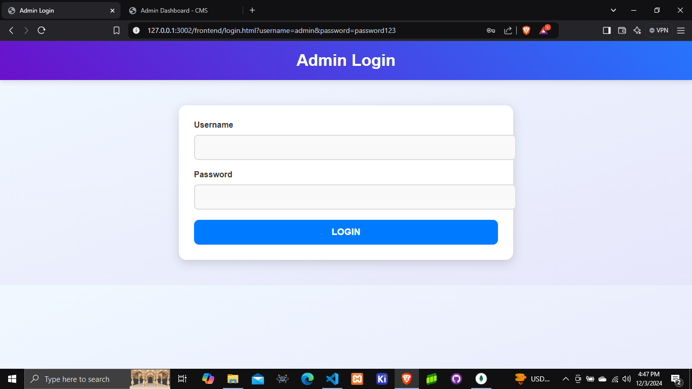
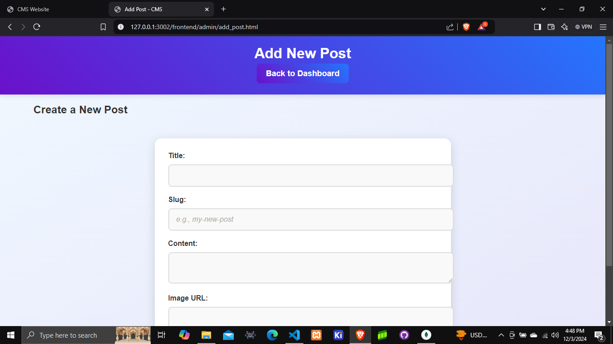
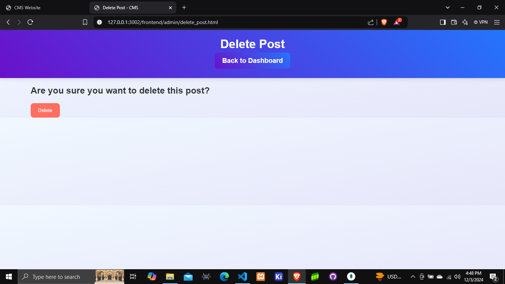
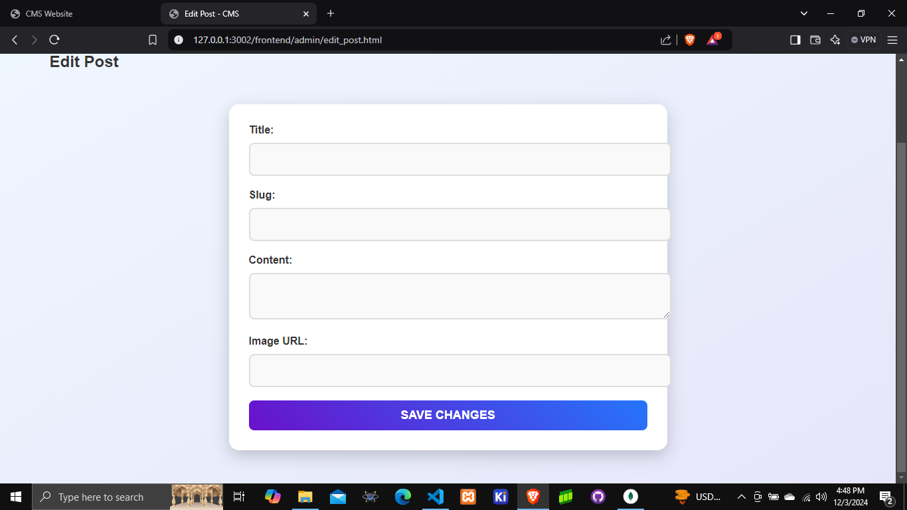
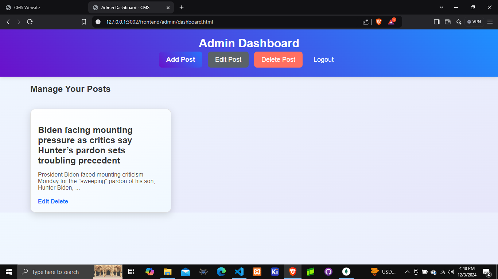
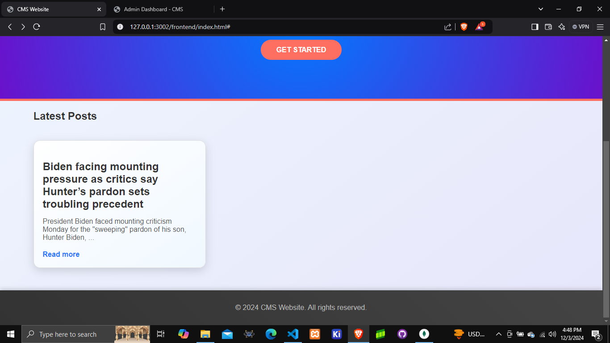

---

# CMS Website - Admin Panel 👩‍💻👨‍💻

Welcome to the **CMS Website**! This is a Content Management System (CMS) that allows an admin to manage posts via an easy-to-use dashboard. It includes features like **login authentication**, **adding, editing, and deleting posts**, and **session management** using JWT tokens. 🔑

---

## Features ✨
### 1. Login Authentication 🔒

- **Admin Login** 🔐: Secure authentication using JWT tokens.

- **Admin Dashboard** 📊: Access to the admin panel after successful login.


- **Post Management** 📝: Add, edit, and delete posts with ease.

- **Session Management** 🕒: Manage user sessions using JWT tokens.

- **Responsive Design** 📱: Works seamlessly on all devices.

- **User-Friendly Interface** 🎉: Easy to navigate and use.

- **Error Handling** 🚫: Handles errors and exceptions gracefully.


### 2. Post Management 
- **Add Post** 📝: Create new posts with ease.
- **Edit Post** ✍️: Update existing posts with ease.

- **Delete Post** 🚮: Remove unwanted posts with ease.
- **Fetch Posts** 📊: Retrieve a list of all posts.
### 3. Session Management
- **Login** 🔒: Securely log in to the admin panel.
- **Logout** 🔓: Log out of the admin panel securely.
### 4. Responsive Design
- **Mobile-Friendly** 📱: Works seamlessly on all devices.
### 5. User-Friendly Interface
- **Easy Navigation** 🎉: Easy to navigate and use.
### 6. Error Handling
- **Error Messages** 🚫: Handles errors and exceptions gracefully
### 7. JWT Tokens
- **Secure Authentication** 🔒: Secure authentication using JWT tokens

### 8. Admin Dashboard

- **Posts List** 📊: View a list of all posts.
- **Add Post** 📝: Create new posts with ease.
- **Edit Post** ✍️: Update existing posts with ease.
- **Delete Post** 🚮: Remove unwanted posts with ease
### 9. Posts List
- **Fetch Posts** 📊: Retrieve a list of all posts

### 10. Error Messages
- **Error Messages** 🚫: Handles errors and exceptions gracefully

---


---

## Tech Stack 🛠️

- **Frontend**: 
  - HTML5, CSS3, JavaScript
  - Fetch API for AJAX requests
  - JWT Authentication for session management
  
- **Backend**:
  - Node.js with Express.js
  - MongoDB for storing post data
  - JWT for authentication
  - Bcrypt.js for password hashing

---

## Installation 📥

### Prerequisites

- **Node.js** and **npm** installed on your machine. You can download them from [nodejs.org](https://nodejs.org/).
- **MongoDB** running locally or a cloud MongoDB instance (e.g., MongoDB Atlas).

### 1. Clone the repository

```bash
git clone https://github.com/NexusGKSoftwares/CMS.git
cd CMS
```

### 2. Install Dependencies

Run the following command to install dependencies for both the **frontend** and **backend**:

```bash
npm install
```

### 3. Setup MongoDB

- Ensure **MongoDB** is running on your local machine or use [MongoDB Atlas](https://www.mongodb.com/cloud/atlas) for a cloud database.
- Update your MongoDB connection URL in the `server.js` file:

```javascript
mongoose.connect('mongodb://localhost:27017/cms_website', {
    useNewUrlParser: true,
    useUnifiedTopology: true
})
```

### 4. Run the Application 🚀

Start the backend server:

```bash
node server.js
```

The server will run on `http://localhost:5000`. 🎉

---

## Usage 🖥️

1. **Admin Login**:
   - Navigate to `login.html` and enter the **username** and **password**.
   - Admin credentials are saved in MongoDB, and you can add the first admin via a script or via the database directly.
   
2. **Dashboard**:
   - After logging in, the admin will be redirected to the **dashboard**, where they can view and manage posts.
   
3. **CRUD Operations**:
   - **Add Post**: The admin can create new posts via the **Add Post** form.
   - **Edit Post**: Admin can edit any post using the **Edit Post** page.
   - **Delete Post**: Admin can remove posts via the **Delete Post** page.

---

## Authentication 🔑

This project uses **JWT Authentication** to ensure that only logged-in users can access admin routes.

- **Login**: Send a POST request with the username and password to `/auth/login`.
- **JWT Token**: After a successful login, the server sends a JWT token, which should be stored in `localStorage` for subsequent requests.

### Protecting Routes

The backend uses JWT tokens to protect routes such as adding, editing, and deleting posts.

```javascript
const authenticateToken = require('./middleware/authMiddleware');

app.use('/admin', authenticateToken, adminRoutes);
```

---

## Future Improvements 🚀

- **User Roles**: Add different user roles (e.g., Editor, Viewer).
- **File Uploads**: Implement image uploads for posts.
- **Error Handling**: Improve error messages and handling throughout the app.

---

## Contributing 🤝

We welcome contributions! If you find any bugs or want to add features, feel free to open an issue or submit a pull request. Please follow these steps:

1. Fork the repository.
2. Create a new branch (`git checkout -b feature-name`).
3. Commit your changes (`git commit -am 'Add feature'`).
4. Push to the branch (`git push origin feature-name`).
5. Open a pull request.

---

## License 📜

This project is licensed under the MIT License - see the [LICENSE](LICENSE) file for details.

---

## Contact 📬

- **Author**: [Your Name](https://yourwebsite.com)
- **Email**: your.email@example.com

---

### 🚀 **Happy coding!** ✨

---
